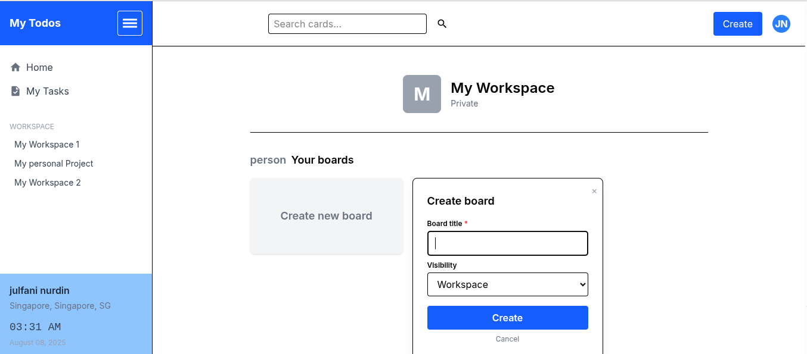
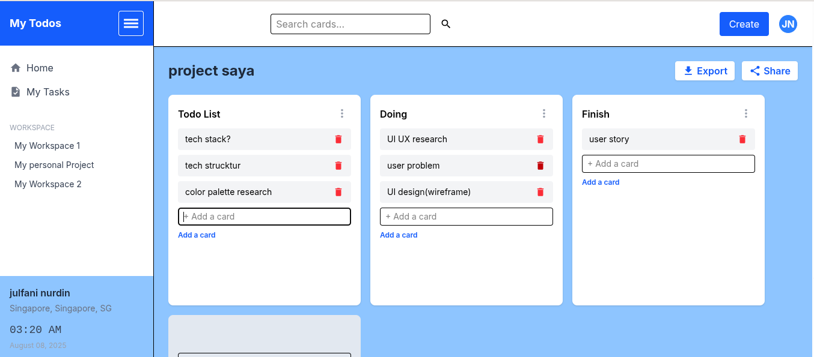

# My Todo List (Trello-like App)

A modern, fast, and user-friendly todo list & kanban board app inspired by Trello. Built with React, TypeScript, Vite, Redux Toolkit, and Redux-Saga.

---

## ✨ Features

- **Multi-board**: Create, rename, and delete multiple boards (projects)
- **Kanban-style lists**: Each board has customizable lists (Todo, Doing, Finish, etc.)
- **Drag & drop cards**: Move cards between lists easily (powered by @hello-pangea/dnd)
- **Persistent**: All data is saved in your browser (localStorage)
- **Search**: Instantly search cards across all boards
- **Responsive UI**: Works great on desktop and mobile
- **Custom toast notifications**: Get feedback for every action
- **Loading indicator**: Smooth progress bar on page/API load
- **User time & location widget**: See your current time and city

---

## 🚀 Getting Started

### 1. Clone the repository

```bash
git clone https://github.com/Julfaninurdinnst/my-todo-list.git
cd my-todo-list
```

### 2. Install dependencies

```bash
npm install
```

### 3. Start the development server

```bash
npm run dev
```

Open [http://localhost:5173](http://localhost:5173) in your browser.

---

## 🛠️ Usage

- **Create Board**: Click "Create new board" on the home page.
- **Rename/Delete Board**: Hover a board, click the pencil (rename) or trash (delete) icon.
- **Open Board**: Click a board title to open its kanban view.
- **Add/Move Cards**: Use the plus button in each list, drag cards between lists.
- **Search**: Use the search bar at the top to find cards by name.
- **Sidebar**: Use the sidebar to quickly access "My Tasks" (last opened board) and workspaces.

All changes are saved automatically in your browser.

---

## 🧩 Tech Stack

- [React](https://react.dev/) + [TypeScript](https://www.typescriptlang.org/)
- [Vite](https://vitejs.dev/) (fast dev/build)
- [Tailwind CSS](https://tailwindcss.com/) (utility-first styling)
- [Redux Toolkit](https://redux-toolkit.js.org/) (state management)
- [Redux-Saga](https://redux-saga.js.org/) (side effects)
- [@hello-pangea/dnd](https://github.com/hello-pangea/dnd) (drag & drop)
- [nprogress](https://ricostacruz.com/nprogress/) (loading bar)

---

## 🚀 Public API

We are use a public API for convert an IP to Location,
 https://ipinfo.io/. you can register and get a token from there...


## 🤝 Contributing

Pull requests are welcome! For major changes, please open an issue first to discuss what you would like to change.

---

## 📄 License

MIT

## 📸 Screenshots




